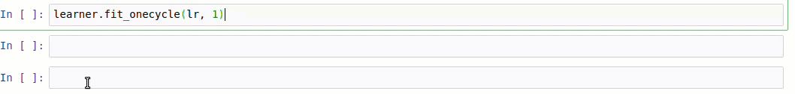

# TorchFit

`TorchFit` is a bare-bones, minimalistic *training-helper* for **PyTorch** that exposes an easy-to-use `fit` method in the style of **fastai** and **Keras**.  

`TorchFit` is intended to be minimally-invasive with a tiny footprint and as little bloat as possible. It is well-suited to those that are new to training models in PyTorch. 

## Usage

```python


# normal PyTorch stuff
train_loader = create_your_training_data_loader()
val_loader = create_your_validation_data_loader()
test_loader = create_your_test_data_loader()
model = create_your_pytorch_model()

# wrap model and data in Learner
import torchfit
learner = torchfit.Learner(model, train_loader, val_loader=val_loader)

# estimate LR using Learning Rate Finder
learner.find_lr()

# train using 1cycle learning rate policy
learner.fit_onecycle(1e-4, 3)

# plot training vs. validation loss
learner.plot('loss')

# make predictions as easy as in Keras
y_pred = learner.predict(test_loader)

# save model and reload later
learner.save('/tmp/mymodel')
learer.load('/tmp/mymodel')
```


#### `TorchFit` Training Loop



### For more information, see the the following notebooks:
- **[Quickstart with MNIST](https://github.com/amaiya/torchfit/blob/master/examples/quickstart-mnist.ipynb):**  quickstart notebook to get you up and running
- **[Tutorial Notebook](https://github.com/amaiya/torchfit/blob/master/examples/tutorial.ipynb):**  tutorial notebook using the same model and data employed in the [PyTorch text classification tutorial](https://pytorch.org/tutorials/beginner/text_sentiment_ngrams_tutorial.html)


## Installation

After ensuring [PyTorch is installed](https://pytorch.org/get-started/locally/), install `TorchFit` with:

```
pip3 install torchfit

```

<!-- pip3 install pillow==6.2.2 torch==1.3.1+cu100 torchvision==0.4.2+cu100 -f https://download.pytorch.org/whl/torch_stable.html -->
